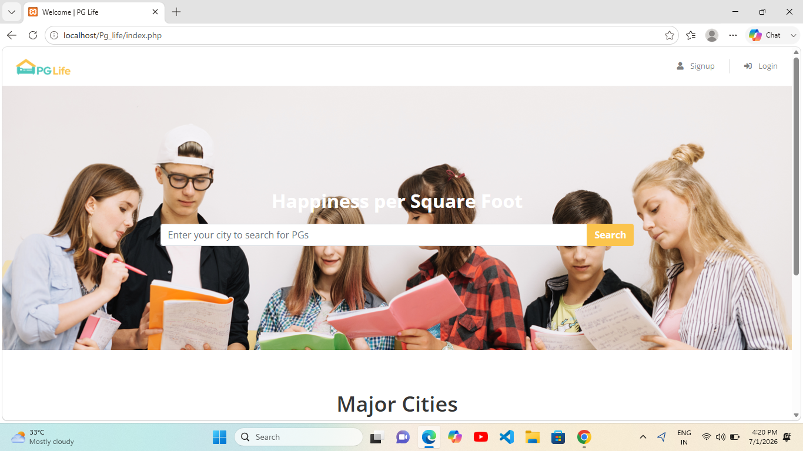
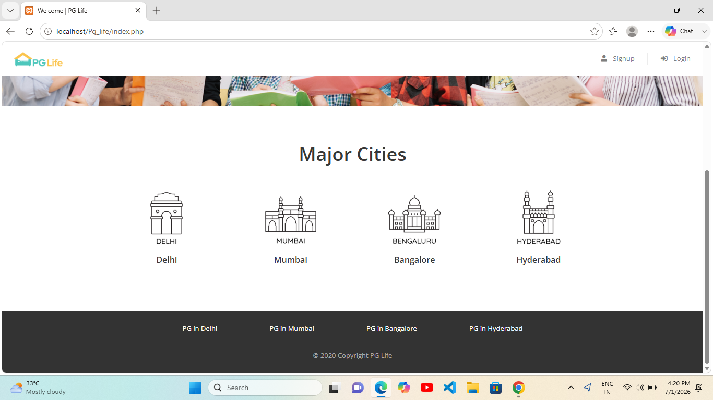
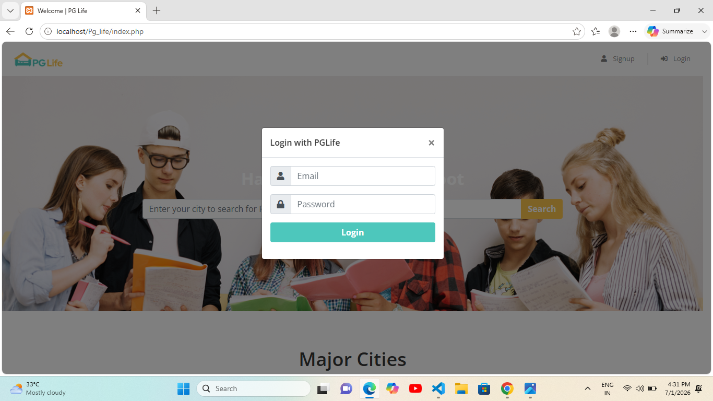
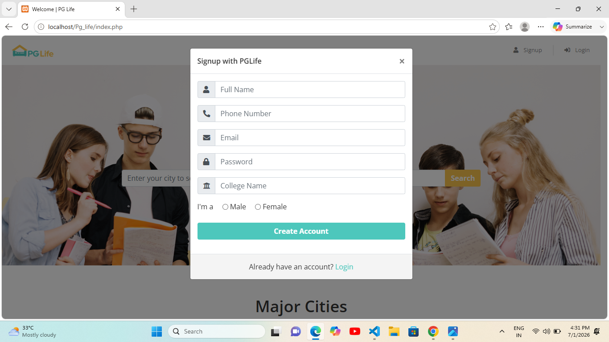
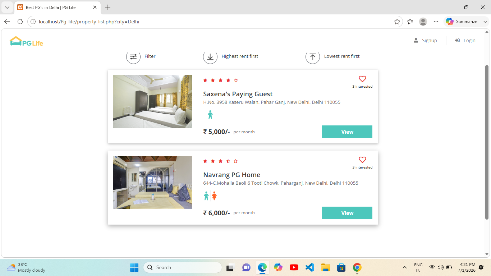
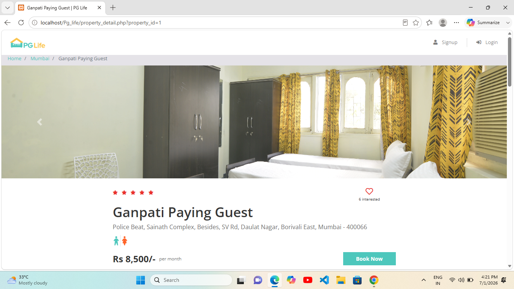
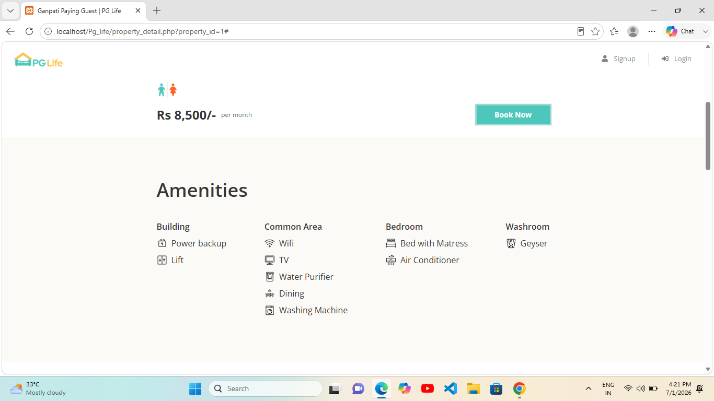
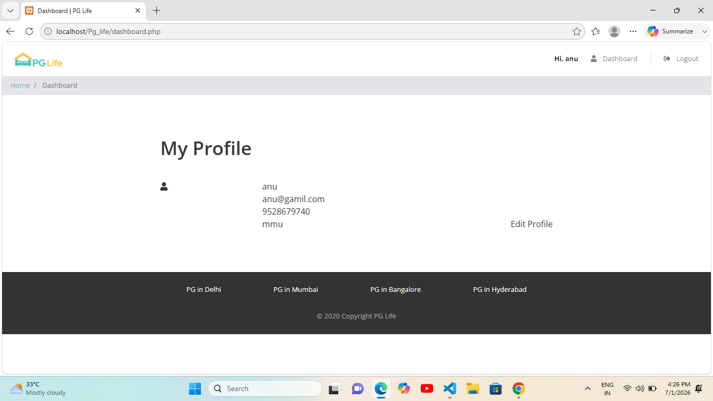

# 🏠 PG-Life
PG-Life is a responsive web application developed using **PHP, MySQL, HTML, CSS, JavaScript, Bootstrap, and jQuery**. The application helps students and working professionals search for Paying Guest (PG) accommodations, explore property details, and manage their accounts through a simple, secure, and user-friendly interface.
## ✨ Features
- User Registration and Login
- Search PGs by City
- View Detailed Property Information
- User Dashboard
- Responsive User Interface
- Secure Session Management
- Clean and Easy-to-Use Design

## 🛠️ Tech Stack

- PHP
- MySQL
- HTML5
- CSS3
- JavaScript
- Bootstrap
- jQuery

## 📂 Project Structure

```text
PG-Life/
├── api/
├── css/
├── img/
├── includes/
├── js/
├── dashboard.php
├── favicon.ico
├── index.php
├── logout.php
├── property_detail.php
└── property_list.php
```
## ⚙️ Installation

1. Clone the repository.

```bash
git clone https://github.com/riyapundir051-u/PG-Life.git
```

2. Move the project folder to the `htdocs` directory in XAMPP.

3. Start **Apache** and **MySQL** from the XAMPP Control Panel.

4. Import the project database into **phpMyAdmin**.

5. Update the database configuration in `includes/database_connect.php` if required.

6. Open your browser and visit:

```text
http://localhost/Pg_life/
```

## 📸 Screenshots

### 🏠 Home Page





### 🔐 Login



### 📝 Sign Up



### 🏢 Property List



### 🏠 Property Detail





### 👤 Dashboard


## 🚀 Future Enhancements

* Online Booking System
* Payment Gateway Integration
* Google Maps Integration
* User Reviews and Ratings
* Admin Dashboard
* Email Verification
* Mobile-Friendly Enhancements
  
## 🤝 Contributing

Contributions, suggestions, and improvements are welcome. Feel free to fork the repository and submit a pull request.
## 👩‍💻 Author

**Riya Pundir**

B.Tech Computer Science Engineering Student

GitHub: https://github.com/riyapundir051-u

## 📄 License

This project is developed for educational and learning purposes only.
